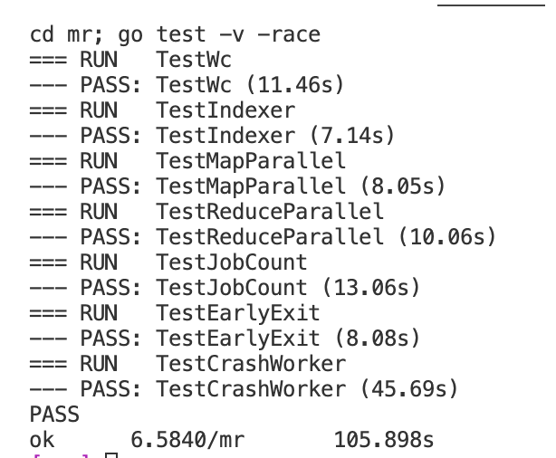
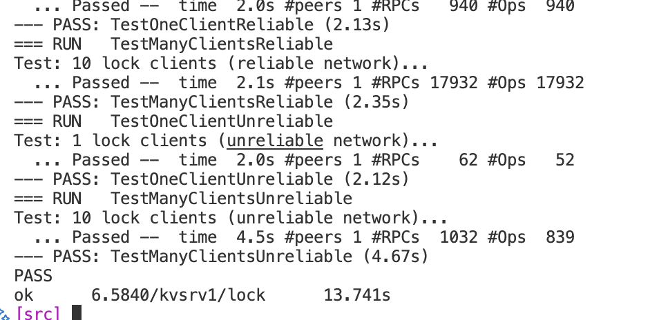
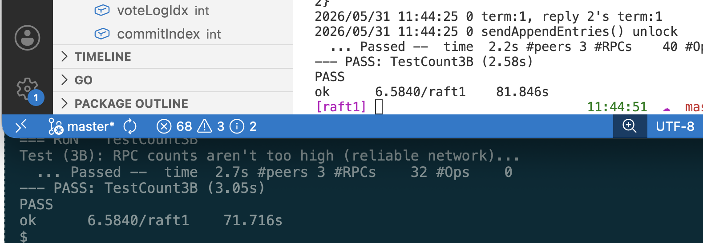

# 6.5840

## Lab 1

## Lab 2

## Lab 3

Raft服务器状态:
- leader: 仅有一台, 处理所有client的请求
- follower: 最多n-1台, 仅回复leader和candidate的请求, 转发client的请求到leader
- candidate: 选举leader

任期**term**: Raft将一次选举开始至下次选举开始的时间段称为**term**, 编号递增. 每段term中所有server的term编号相同, server收到携带更高编号的term的心跳信息后, 必须更新自己的term, 同时回到follower, 对低于自身term的请求予以拒绝

### 选举过程

当server在一段时间内未收到leader的心跳RPC, 就增加自身的term并自荐为leader成为candidate, 向其它server发送RequestVote, 若:
- 收到超过半数的Vote回复, 则成为leader, 即自身状态uptodate多数server
- 收到≥自身term的leader请求, 自身退化follower, 否则拒绝
- 本次没有选出leader, 随机退避一段时间后再次发起选举
> 每轮选举中server遵守FCFS(先来先服务)原则, 最多对第一个uptodate的server投票

### 日志复制

leader收到client请求, 追加到本地log, AppendEntries RPC同步日志到其它server, 再回复client

当log被多数server成功追加, 称为committed

AppendEntries携带上次追加log的index和term, follower检查自身最新log的index和term是否与leader一致: 
- 若一致则追加
- 若小于leader的term则拒绝, leader递减index直至找到一致点, 覆盖follower该index之后所有log
- 若term一致且index大于leader, 或term大于leader则拒绝, 并在之后成为leader

### Lab 3A 3B
